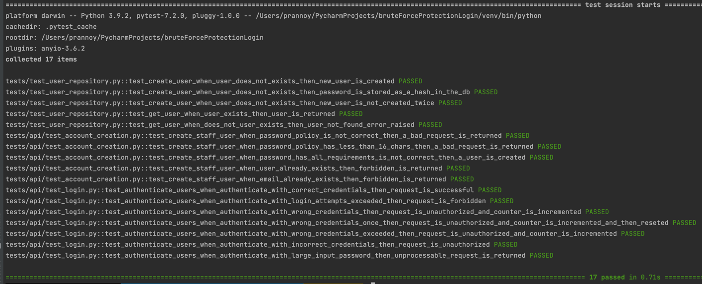

# Description

This project implements a simple REST API for a web-based appointment and scheduling management information system (ASMIS).
The API is scoped to creating users and verifying their credentials with security as the primary focus. 
The few security measures implemented here are explained in the section [Implemented security measures for ASMIS authentication system](#implemented-security-measures-for-the-asmis-authentication-system).

# Getting Started 🚀

### Prerequisites
* <a href=https://www.python.org/downloads/release/python-370/> Python 3.7 or Greater</a>
* <a href=https://pip.pypa.io/en/stable/installation/> pip 21.3.1 or Greater</a>

After installing the requirements run the following commands in order
```bash
python -m venv ./venv # creates python virtual environment for the project
source ./venv/bin/activate # activates virtual environment, this is on mac or linux
.\venv\Scripts\activate.bat # This is for windows
python -m pip install --upgrade pip # upgrade pip to get the latest packages
pip -V  #Is used to check if the virtual environment is being used 
pip install -r requirements.txt # Install all required dependencies
python -m uvicorn main:app --reload # Runs the server
```

### Valid Users to test from in the UI

To use the API, run the server and enter http://127.0.0.1:8000/api/v1/docs and 
the available endpoints will be displayed.

```json
{
  "username": "user1",
  "password": "V3ryG00dPassw0rd?!",
  "email": "user1@hello.com"
}
```

### Dependency Injection

## Automated Tests
The mitigations implemented in this project are all tested using ```pytest``` to see if the security measures implemented for the system's endpoints behave as intended. 
The test cases can be seen [tests](./tests).

```bash
# Run unit test
python -m pytest tests/ -v 
```


# Implemented security measures for the ASMIS authentication system

* The usernames and password inputs have a max length of ```64 characters``` to prevent injection attacks.
* The passwords must follow strict patterns of having at least ```16 characters, 2 digits, 2 Uppercase, 2 Lowercase, and 2 digits```.
This helps prevents staff from practicing poor password hygiene and makes brute force attacks harder.
* Passwords are stored using argon2id (memory-hard algorithm) hashing algorithms resilient against side-channel and GPU attacks.
  Example ```$argon2id$v=19$m=65536,t=3,p=4$ngO2O3DDwuUuVttzpwIyWA$CjigQrhs4Yvh2cNd2/x/K4hhcZFuj1XCvWzHvcqxM08```(Biryukov, A. 2016, pg.293)
* Used argon2 ```verify (hashed_password, to_be_verified_password)``` function to verify password instead of making a
  string comparison, also prevents side-channel attacks.
* Used SQL Model functions ```select(Staff).where(Staff.username == username)``` which sanitizes the SQL statements
  preventing SQL injection.
* The login attempt is validated and counted up to five times, then the user is blocked for 10 minutes.
* The timestamp of the last login attempt is also stored for auditing purposes.
* If login or creation of user fails due to wrong username or password or already existing data. The error message forwarded is generic and does
not expose any information about what is missing or wrong.

# References

* Tutorial on how to run fastapi in a local
  environment <a href=https://fastapi.tiangolo.com/tutorial/first-steps/ class="external-link" target="_blank">
  Fast API</a>.
* A sample full-stack project to build an API using fast
  API <a href=https://github.com/scionoftech/FastAPI-Full-Stack-Samples class="external-link" target="_blank">
  Github</a>.
* Tutorial on implementing and testing SQLModel ORM to connect the database to the
  application <a href=https://sqlmodel.tiangolo.com/tutorial/fastapi/tests/#configure-the-in-memory-database>
  SQLMODEL</a>.
* Biryukov, A., Dinu, D. and Khovratovich, D., 2016, March. Argon2: new generation of memory-hard functions for password hashing and other applications. In 2016 IEEE European Symposium on Security and Privacy (EuroS&P) (pp. 292-302). IEEE.