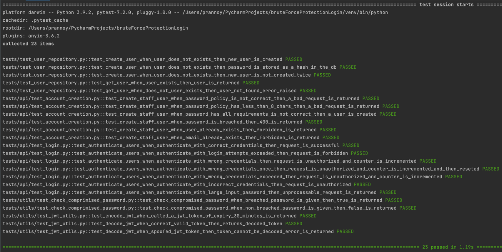
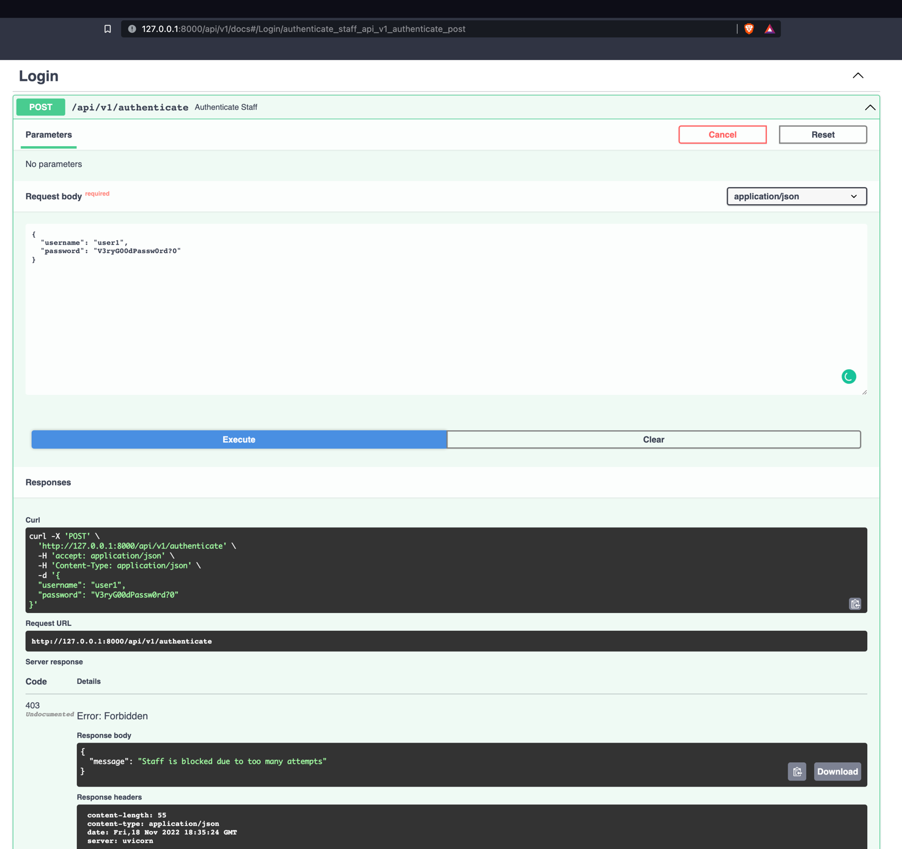

# Description

This project implements a simple REST API for a web-based appointment and scheduling management information system (ASMIS).
The API is scoped to creating users and verifying their credentials with security as the primary focus.

# Getting Started 🚀

### Prerequisites
* <a href=https://www.python.org/downloads/release/python-370/> Python 3.7 or Greater</a>
* <a href=https://pip.pypa.io/en/stable/installation/> pip 21.3.1 or Greater</a>

After installing the requirements, run the following commands in order
```bash
# creates python virtual environment for the project
python -m venv ./venv 

# activates virtual environment; this is on Mac or Linux
source ./venv/bin/activate 

# This is for windows
.\venv\Scripts\activate.bat 

# upgrade pip to get the latest packages
python -m pip install --upgrade pip 

#Is used to check if the virtual environment is being used 
pip -V  

# Install all required dependencies
pip install -r requirements.txt 

# Runs the server
python -m uvicorn main:app --reload 
```

### Valid Users to test from in the UI

To use the API, run the server and enter http://127.0.0.1:8000/api/v1/docs and 
the available endpoints will be displayed.

```json
{
  "username": "user1",
  "password": "V3ryG00dPassw0rd?!",
  "email": "user1@hello.com"
}
```
### Configuration
The database and application settings are configured in the file [config.json](./config/config.json). 

## Automated Tests
The mitigations implemented in this project are all tested using ```pytest``` to see if the security measures implemented for the system's endpoints behave as intended. 
All the positive and negative tests related to security are carried out here.

```bash
# Run tests
python -m pytest tests/ -v 
```
The test cases can be found in the package [tests](./tests).



# Implemented security measures for the ASMIS authentication system

* The usernames and password inputs have a max length of ```64 characters``` preventing injection attacks.
* The passwords must follow strict patterns of having at least ```8 characters, 2 digits, 2 Uppercase, 2 Lowercase, and 2 digits```.
This helps prevents staff from practicing poor password hygiene and makes brute force attacks harder.
* Passwords are stored using argon2id (memory-hard algorithm) hashing algorithms resilient against side-channel and GPU attacks.
  Example ```$argon2id$v=19$m=65536,t=3,p=4$ngO2O3DDwuUuVttzpwIyWA$CjigQrhs4Yvh2cNd2/x/K4hhcZFuj1XCvWzHvcqxM08```(Biryukov, A. 2016, pg.293)
* Used argon2 ```verify (hashed_password, to_be_verified_password)``` function to verify password instead of making a
  string comparison, also prevents side-channel attacks.
* Used SQL Model functions ```select(Staff).where(Staff.username == username)``` which sanitizes the SQL statements
  preventing SQL injection.
* The login attempt is validated and counted up to five times, then the user is blocked for 10 minutes.
* The timestamp of the last login attempt is also stored for auditing purposes.
* If login or creation of user fails due to wrong username or password or already existing data. The error message forwarded is generic and does
not expose any information about what is missing or wrong.
* After authentication tokens are signed using a [private key](./private_key_for_testing_purposes.pem). 
The digitally signed tokens prevents spoofing. The spoofing is tested using an unsigned token which is rejected by the [automatic test](./tests/utils/test_jwt_utils.py).   
* Logging application error in ```JSON``` format, this helps the Security information and event management (SIEM) parse the errors easily.
* Breached credentials are checked using pawned password API. Using K-anonymity only first 5 letters of the SHA1 is sent to the API for comparison
and is then evaluated in the code.

# Outputs
* The example for an output log in JSON can be found in the output folder [error_log_output.json](./docs/outputs/error_log_ouput.json).
* The database output can be found in [test.db](test.db). This file can be opened using a DBMS, like SQL workbench, etc. 
Execute ```Select * from main.staff``` to see all the contents of the table.

* The staff creation process using the swagger UI to call the ```/addUser``` endpoint, a success HTTP status 201 created is returned.

  * 

* The staff creation process using the swagger UI to call the ```/authenticate``` endpoint, a success HTTP status 200 created. A Signed JWT token is used so that Oauth flow can be implemented (Oauth.net. 2020).
  * 
* A user is blocked due to too many login attempts.
  * * 
# References

* Tutorial on how to run fastapi in a local
  environment <a href=https://fastapi.tiangolo.com/tutorial/first-steps/ class="external-link" target="_blank">
  Fast API</a>.
* A sample full-stack project to build an API using fast
  API <a href=https://github.com/scionoftech/FastAPI-Full-Stack-Samples class="external-link" target="_blank">
  Github</a>.
* Tutorial on implementing and testing SQLModel ORM to connect the database to the
  application <a href=https://sqlmodel.tiangolo.com/tutorial/fastapi/tests/#configure-the-in-memory-database>
  SQLMODEL</a>.
* How to configure a custom logger in Json in python <a href=https://pypi.org/project/python-json-logger/> Json Logger</a>.
* Biryukov, A., Dinu, D. and Khovratovich, D., 2016, March. Argon2: new generation of memory-hard functions for password hashing and other applications. In 2016 IEEE European Symposium on Security and Privacy (EuroS&P) (pp. 292-302). IEEE.
* Oauth.net. (2020). OAuth 2.0 — OAuth. [online] Available at: https://oauth.net/2/.
* Checking for breached passwords using K-anonymity <a href=https://sanatinia.medium.com/securely-check-if-a-password-is-compromised-in-python-be74bf52b0cc> Checking Breached Passwords</a>.